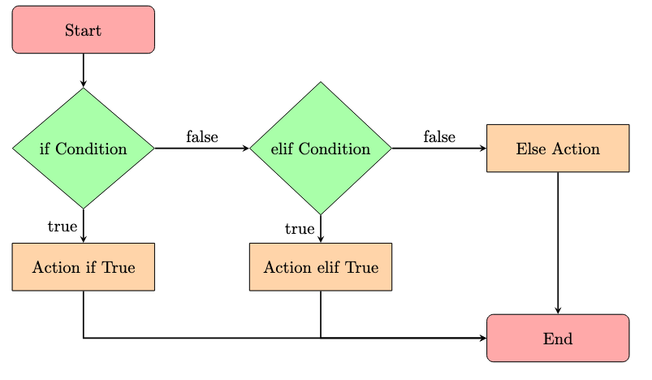

# Declaraciones Condicionales

## Objetivos de Aprendizaje
- ✅ Comprender cómo usar las declaraciones `if`, `elif` y `else` en Python para la toma de decisiones.
- ✅ Aprender cómo aplicar **lógica condicional** para controlar el flujo de un programa.
- ✅ Demostrar un caso de prueba con **entrada pre-grabada** para mostrar cómo funcionan las declaraciones condicionales.

## ¿Qué Son las Declaraciones `if` en Python?
- Las declaraciones `if` **controlan el flujo del programa** ejecutando bloques de código basándose en si las condiciones son `True` o `False`.

---

## ¿Por Qué Usar Declaraciones `if`?
- **Toma de Decisiones** - Las declaraciones `if` permiten que un programa tome decisiones.
- **Flexibilidad** - Permiten comportamiento dinámico basado en la entrada del usuario o condiciones.

---

## ¿Cómo Funcionan las Declaraciones `if`?
- `if` - **Ejecuta** un bloque de código **si la condición es `True`**.
   
    

- `elif` - **Verifica otra condición** si el primer `if` fue `False`.

- `else` - **Se ejecuta si todas las condiciones anteriores fueron `False`**.

    

---

## Ejemplos de Declaraciones Condicionales

### Declaración `if` Básica
```python
age = int(input("Ingresa tu edad: "))  # Convertir entrada a un entero

if age >= 18:
    print("Eres un adulto.")
else:
    print("Eres un menor.")
```

### Usando `if-elif-else`
```python
temperature = float(input("Ingresa la temperatura: "))  # Convertir entrada a un flotante

if temperature > 30:
    print("¡Hace calor afuera!")
elif temperature > 20:
    print("El clima es agradable.")
else:
    print("Hace frío afuera.")
```

---

## Determinando una Calificación Basada en el Puntaje

### Usando Declaraciones `if` Anidadas
```python
score = 74  # Puntaje de ejemplo

if score >= 90:
    grade = "A"
else:
    if score >= 80:
        grade = "B"
    else:
        if score >= 70:
            grade = "C"
        else:
            if score >= 60:
                grade = "D"
            else:
                grade = "F"

print(f"Puntaje: {score}, Calificación: {grade}")
```

### Usando `if-elif-else` (Mejor Alternativa)
```python
score = 74  # Puntaje de ejemplo

if score >= 90:
    grade = "A"
elif score >= 80:
    grade = "B"
elif score >= 70:
    grade = "C"
elif score >= 60:
    grade = "D"
else:
    grade = "F"

print(f"Puntaje: {score}, Calificación: {grade}")
```

---

## Puntos Clave
- Usa **declaraciones `if`** para controlar el flujo de un programa.
- **`elif` permite múltiples condiciones**, y `else` captura todos los demás casos.
- Las declaraciones condicionales hacen que los programas sean **más flexibles e interactivos**.

🚀 **¡Inténtalo Tú Mismo!** ¡Modifica los ejemplos para experimentar con diferentes entradas y condiciones!

---

## Pregunta:

Crea un script de Python llamado **`conditional.py`** que haga lo siguiente:

1. **Solicitar entrada al usuario** usando:
```python
   input("Input number\n")
```
2. **Convertir el número ingresado** (que será un entero) a su forma de palabra correspondiente **si está entre 1 y 5 (inclusive)**:
   * `1` → `"one"`
   * `2` → `"two"`
   * `3` → `"three"`
   * `4` → `"four"`
   * `5` → `"five"`
3. **Si el número ingresado está fuera del rango 1–5**, imprimir:
```plaintext
   Outside of range
```

**Ejemplos de Ejecución:**

* **Dentro del rango:**
  Entrada:
```plaintext
  1
```
  Salida:
```plaintext
  one
```
* **Fuera del rango:**
  Entrada:
```plaintext
  60
```
  Salida:
```plaintext
  Outside of range
```