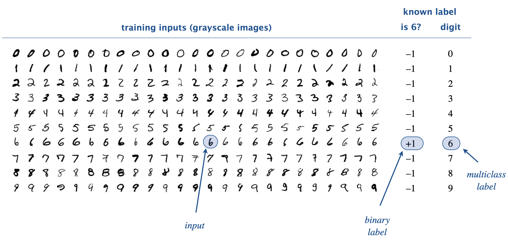
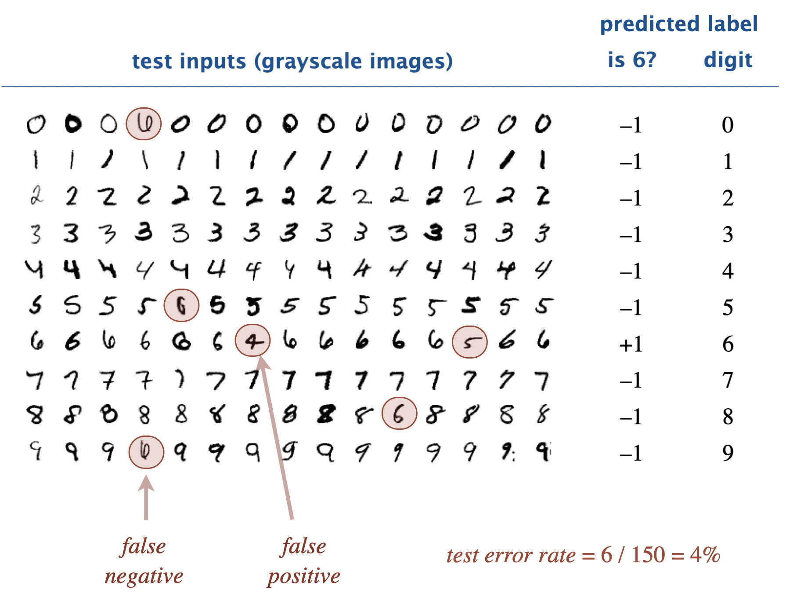
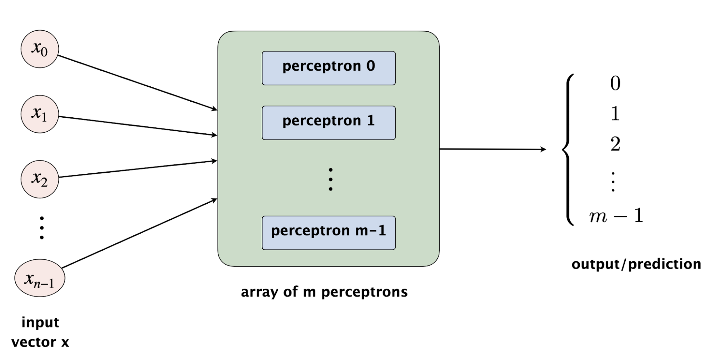
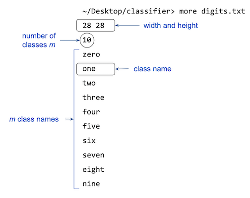
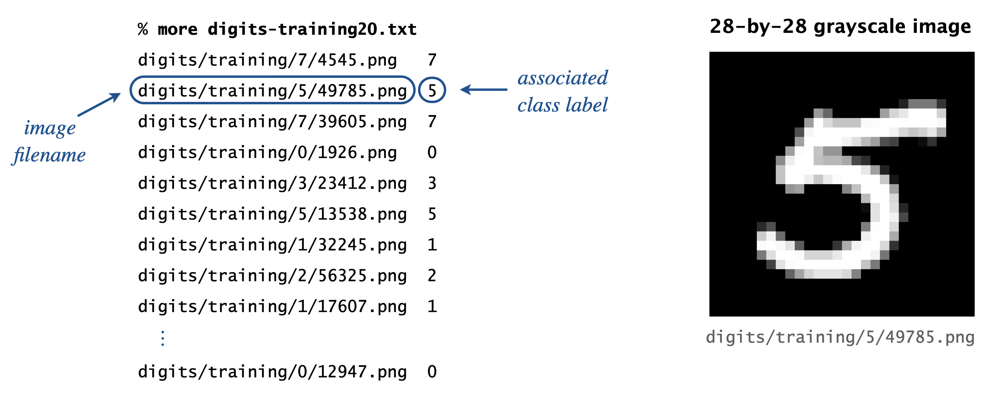

# Clasificador de Imágenes — Competencia de Ingeniería en Equipo

*En este proyecto, implementarán el algoritmo del perceptrón en Python puro y lo usarán para clasificar dígitos escritos a mano. Luego evaluarán la precisión de su clasificador y competirán con otros equipos en la tasa de error de prueba.*

---

## Cómo Empezar

- Formen equipos de 3 a 4 estudiantes. Revisen la política de colaboración en equipo.
- Repasen los módulos sobre **Listas y Listas Anidadas**, **Funciones**, **Clases**, **E/S de Archivos**, e **Introducción a las Bibliotecas**.
- Lean (o al menos hojeen) toda la descripción del proyecto antes de escribir código — tener la *visión completa* les ahorrará mucho tiempo.
- Descarguen el paquete de inicio del proyecto (que contiene conjuntos de datos de muestra y archivos de configuración).
- Sigan las instruciones de la descripción del proyecto y el readme.md del paquete del proyecto. 

---

## Contexto

La **clasificación** es una tarea fundamental en aprendizaje automático: dada una entrada (una imagen, un texto, una medición), predecir a qué **categoría** pertenece. Como ejemplo familiar: cada vez que su teléfono se desbloquea reconociendo su rostro, hay un clasificador trabajando.

En este proyecto, implementarán el **algoritmo del perceptrón** para reconocer dígitos escritos a mano usando **aprendizaje supervisado**. El aprendizaje supervisado tiene dos fases:

- **Entrenamiento:** el algoritmo aprende una función que mapea entradas a etiquetas a partir de una colección de ejemplos etiquetados. Para reconocimiento de dígitos, el conjunto de entrenamiento contiene 60.000 imágenes en escala de grises y sus dígitos correspondientes (del 0 al 9).



- **Prueba:** el algoritmo se evalúa prediciendo etiquetas para entradas *no vistas* que no se usaron durante el entrenamiento. La fracción de entradas mal clasificadas es la **tasa de error de prueba** — la métrica principal de qué tan bien generaliza su clasificador.



### Clasificación Binaria vs. Multiclase

En la **clasificación binaria**, asignamos cada entrada a una de dos categorías (por ejemplo, "esto es un 6" vs. "esto no es un 6"). Por convención, etiquetamos estas categorías como +1 (positivo) y -1 (negativo).

En la **clasificación multiclase**, asignamos cada entrada a una de $m$ categorías, etiquetadas $0, 1, \ldots, m-1$. Para los dígitos escritos a mano, $m = 10$.

El truco que usaremos a lo largo del proyecto es reducir un problema multiclase a $m$ problemas binarios — una técnica llamada clasificación **uno-contra-todos**. Entrenamos un clasificador binario por clase, cada uno especializado en reconocer "¿es esto *mi* clase?" Para predecir, le preguntamos a los $m$ clasificadores y elegimos el que tenga la mayor confianza en el sí.

### ¿Qué es un Perceptrón?

Un **perceptrón** es un modelo matemático simplificado de una sola neurona biológica. Toma un vector de entrada $x = (x_0, x_1, \ldots, x_{n-1})$ de $n$ números reales y produce una etiqueta binaria $+1$ o $-1$.

Un perceptrón se define por un **vector de pesos** $w = (w_0, w_1, \ldots, w_{n-1})$ y un escalar **bias** $b$, ambos aprendibles. Dada una entrada $x$, calcula la **suma ponderada**

$$
S = w_0 \cdot x_0 + w_1 \cdot x_1 + \cdots + w_{n-1} \cdot x_{n-1} + b
$$

y produce $+1$ si $S > 0$, en caso contrario $-1$.

El **bias** $b$ es un término independiente de la entrada que desplaza la frontera de decisión. Sin él, el perceptrón solo puede aprender funciones cuya frontera pasa por el origen — una limitación innecesaria que reduce la precisión. Con bias, la frontera puede ubicarse en cualquier lugar del espacio, lo cual es importante para datasets reales donde las clases no están centradas en el origen.

Para reconocer dígitos, el vector de entrada $x$ es la lista de valores de píxeles en escala de grises de una imagen (aplanada a 1D). Para una imagen de 28×28, $n = 784$.

### La Regla de Entrenamiento del Perceptrón

¿Cómo elegimos $w$ y $b$ para que el perceptrón haga predicciones precisas? **Los aprendemos de los datos**, un ejemplo a la vez. Inicializamos todos los pesos y el bias en cero, luego procesamos cada ejemplo etiquetado de entrenamiento:

1. **Predicción correcta.** El perceptrón predice la etiqueta correcta. Dejamos $w$ y $b$ sin cambios.
2. **Falso positivo.** La etiqueta verdadera es $-1$ pero el perceptrón predice $+1$. Restamos $x$ de $w$ y restamos 1 de $b$:
   $$ w_j \leftarrow w_j - x_j \quad \text{para cada } j \qquad b \leftarrow b - 1 $$
3. **Falso negativo.** La etiqueta verdadera es $+1$ pero el perceptrón predice $-1$. Sumamos $x$ a $w$ y sumamos 1 a $b$:
   $$ w_j \leftarrow w_j + x_j \quad \text{para cada } j \qquad b \leftarrow b + 1 $$

La regla del bias es idéntica a la de los pesos, con la diferencia de que el "input" correspondiente al bias siempre vale 1 (es una constante). Por eso el ajuste es siempre $\pm 1$, no un múltiplo de $x$.

### Ejemplo Trabajado

Aquí hay una traza de entrenamiento del perceptrón con cuatro entradas etiquetadas de longitud $n = 3$. La regla es: una entrada $x$ tiene etiqueta $+1$ si y solo si $x_0 \le x_1 \le x_2$.

| Paso | Entrada $x$ | Real | $w$ antes | $b$ antes | $S$ | Pred. | Acción | $w$ después | $b$ después |
|---|---|---|---|---|---|---|---|---|---|
| 0 | — | — | $(0,0,0)$ | $0$ | — | — | inicio | $(0,0,0)$ | $0$ |
| 1 | $(3,4,5)$ | $+1$ | $(0,0,0)$ | $0$ | $0$ | $-1$ | falso neg → sumar | $(3,4,5)$ | $1$ |
| 2 | $(2,0,-2)$ | $-1$ | $(3,4,5)$ | $1$ | $-3$ | $-1$ | correcto | $(3,4,5)$ | $1$ |
| 3 | $(-2,0,2)$ | $+1$ | $(3,4,5)$ | $1$ | $5$ | $+1$ | correcto | $(3,4,5)$ | $1$ |
| 4 | $(5,4,3)$ | $-1$ | $(3,4,5)$ | $1$ | $47$ | $+1$ | falso pos → restar | $(-2,0,2)$ | $0$ |

Verifiquen $S$ en el paso 2: $3(2)+4(0)+5(-2)+1 = 6-10+1 = -3$. ✓

Deben reproducir esta traza con su implementación de `Perceptron`.

---

## Parte 1 — Tipo de Datos `Perceptron`

Creen una clase que represente un solo perceptrón:

```python
class Perceptron:
    def __init__(self, n):
        """Crea un perceptrón con n entradas, todos los pesos en 0 y bias en 0."""

    def number_of_inputs(self):
        """Retorna el número de entradas n (no incluye el bias)."""

    def weighted_sum(self, x):
        """Retorna w[0]*x[0] + ... + w[n-1]*x[n-1] + bias.
        x es una lista de n números reales."""

    def predict(self, x):
        """Retorna +1 si weighted_sum(x) > 0, en caso contrario -1.
        Retorna -1 cuando la suma es exactamente cero."""

    def train(self, x, binary_label):
        """Actualiza los pesos y el bias según la regla de entrenamiento.
        binary_label debe ser +1 o -1."""

    def __str__(self):
        """Retorna una cadena como '(2.0, 1.0, -1.0 | b=5.0)'."""
```

### Requisitos

- **Estructura de datos.** Usen una `list` de Python con valores `float` para el vector de pesos, y un `float` separado para el bias. No usen sets, dicts ni bibliotecas de arreglos de terceros para la implementación principal.
- **Eficiencia.** `weighted_sum`, `predict`, y `train` deben ejecutarse cada uno en tiempo proporcional a $n$. No pueden llamar a `weighted_sum` más de una vez dentro de `predict` o `train`.
- **Casos de borde.** Pueden asumir que todos los argumentos son válidos: `n >= 1`, `len(x) == n`, y `binary_label in (+1, -1)`.
- No agreguen métodos más allá de los listados.

<details>
<summary>Click para mostrar pasos de implementación</summary>

1. En `__init__`, almacenen `n`, creen `self._weights = [0.0] * n`, y creen `self._bias = 0.0`.
2. `number_of_inputs` retorna `self._n`.
3. `weighted_sum` comienza con `total = self._bias` y acumula `self._weights[j] * x[j]` en un bucle.
4. `predict` llama a `weighted_sum` una vez y retorna `+1` o `-1` según el signo.
5. `train` llama a `predict` una vez. Si la predicción es incorrecta:
   - Actualicen `self._weights[j] += binary_label * x[j]` para cada `j`.
   - Actualicen `self._bias += binary_label * 1`.
6. Para `__str__`: `"(" + ", ".join(f"{w:.1f}" for w in self._weights) + f" | b={self._bias:.1f}" + ")"`.

</details>

### Probando `Perceptron`

```python
p = Perceptron(3)
print(p)                    # esperado: (0.0, 0.0, 0.0 | b=0.0)
print(p.number_of_inputs()) # esperado: 3

e1 = [3.0,  4.0,  5.0]   # +1
e2 = [2.0,  0.0, -2.0]   # -1
e3 = [-2.0, 0.0,  2.0]   # +1
e4 = [5.0,  4.0,  3.0]   # -1

assert p.weighted_sum(e1) == 0.0
assert p.predict(e1) == -1

p.train(e1, +1)
print(p)          # esperado: (3.0, 4.0, 5.0 | b=1.0)

p.train(e2, -1)   # correcto — sin cambios
print(p)          # esperado: (3.0, 4.0, 5.0 | b=1.0)

p.train(e3, +1)   # correcto — sin cambios
print(p)          # esperado: (3.0, 4.0, 5.0 | b=1.0)

p.train(e4, -1)   # falso positivo
print(p)          # esperado: (-2.0, 0.0, 2.0 | b=0.0)
```

**No** continúen a la Parte 2 hasta que `Perceptron` pase estas pruebas y cualquier prueba adicional proporcionada por el calificador automático.

---

## Parte 2 — Tipo de Datos `MultiPerceptron`

Para un problema multiclase con $m$ clases, usamos un arreglo de $m$ perceptrones, uno por clase. El perceptrón $i$ se entrena para responder "¿es esta imagen de la clase $i$?"



### Entrenamiento Multiclase

Para cada entrada de entrenamiento etiquetada $(x, \text{clase}=i)$:

- Entrenen el perceptrón $i$ con $x$ con etiqueta binaria $+1$.
- Entrenen cada uno de los otros $m-1$ perceptrones con $x$ con etiqueta binaria $-1$.

En otras palabras, para el perceptrón $k$, los ejemplos de la clase $k$ son positivos y todos los demás son negativos.

### Predicción Multiclase

Para clasificar una entrada $x$, calculen la suma ponderada para cada uno de los $m$ perceptrones. Predigan la clase cuyo perceptrón tenga la **mayor** suma ponderada. Elegimos exactamente una clase incluso si todas las sumas ponderadas son negativas.

Esta estrategia **uno-contra-todos** es un ejemplo de una **reducción**: descomponemos un problema difícil (clasificación de m vías) en muchos problemas más fáciles (clasificación binaria). Las reducciones como esta están en todas partes en ciencias de la computación.

### Clase

```python
class MultiPerceptron:
    def __init__(self, m, n):
        """Crea un multi-perceptrón con m clases y n entradas cada uno."""

    def number_of_classes(self):
        """Retorna m."""

    def number_of_inputs(self):
        """Retorna n."""

    def predict_multi(self, x):
        """Retorna la etiqueta de clase (0..m-1) cuyo perceptrón tiene
        la mayor weighted_sum en x. Empates: retornan el índice más bajo."""

    def train_multi(self, x, class_label):
        """Entrena cada uno de los m perceptrones:
           - perceptron[class_label] con etiqueta binaria +1
           - todos los demás con etiqueta binaria -1"""

    def __str__(self):
        """Retorna una cadena como '((2.0, 0.0, -2.0), (3.0, 4.0, 5.0))'."""
```

### Requisitos

- **Arquitectura.** Internamente, almacenen una lista de `m` objetos `Perceptron`: `[Perceptron(n) for _ in range(m)]`. No dupliquen lógica que ya vive en `Perceptron`.
- **Desempate.** Si dos o más perceptrones empatan por la suma ponderada más alta, retornen la etiqueta de clase *más baja*. Esto hace su salida determinista y fácil de calificar.
- **Eficiencia.** `predict_multi` y `train_multi` deben ejecutarse cada uno en tiempo proporcional a $m \cdot n$. No hagan recorridos extra.

### Probando `MultiPerceptron`

```python
mp = MultiPerceptron(m=2, n=3)
print(mp)  # esperado: ((0.0, 0.0, 0.0 | b=0.0), (0.0, 0.0, 0.0 | b=0.0))

mp.train_multi([3.0, 4.0, 5.0], 1)
print(mp)  # esperado: ((0.0, 0.0, 0.0 | b=0.0), (3.0, 4.0, 5.0 | b=1.0))

mp.train_multi([2.0, 0.0, -2.0], 0)
print(mp)  # esperado: ((2.0, 0.0, -2.0 | b=1.0), (3.0, 4.0, 5.0 | b=1.0))

mp.train_multi([-2.0, 0.0, 2.0], 1)
print(mp)  # esperado: ((2.0, 0.0, -2.0 | b=1.0), (3.0, 4.0, 5.0 | b=1.0))  -- sin cambios

mp.train_multi([5.0, 4.0, 3.0], 0)
print(mp)  # esperado: ((2.0, 0.0, -2.0 | b=1.0), (-2.0, 0.0, 2.0 | b=0.0))

assert mp.predict_multi([-1.0, -2.0, 3.0]) == 1
assert mp.predict_multi([ 2.0, -5.0, 1.0]) == 0
```

---

## Parte 3 — Cliente `ImageClassifier`

Su tarea final es conectar `MultiPerceptron` a imágenes reales. `ImageClassifier` es responsable de **leer archivos de configuración y datos, extraer características de píxeles, entrenar, probar y reportar resultados.**

```python
class ImageClassifier:
    def __init__(self, config_file):
        """Lee el archivo de configuración y crea un MultiPerceptron
        con m clases y n = ancho * alto entradas."""

    def class_name_of(self, label):
        """Retorna el nombre legible de la clase para una etiqueta entera.
        Lanza ValueError si la etiqueta está fuera del rango [0, m-1]."""

    def extract_features(self, image):
        """Toma un objeto Image de Pillow y retorna una lista de ancho*alto
        valores en escala de grises en orden de filas (row-major).
        Lanza ValueError si las dimensiones de la imagen no coinciden
        con la configuración."""

    def train_classifier(self, train_file):
        """Lee un archivo de manifiesto de entrenamiento y entrena con cada ejemplo."""

    def classify_image(self, image):
        """Retorna la etiqueta de clase predicha para una imagen de Pillow."""

    def test_classifier(self, test_file):
        """Lee un manifiesto de prueba, clasifica cada imagen, imprime cada
        ejemplo mal clasificado, y retorna la tasa de error de prueba."""
```

### Formato del Archivo de Configuración



Un archivo de texto plano con las siguientes líneas:

```
28 28
10
zero
one
two
three
four
five
six
seven
eight
nine
```

- Línea 1: ancho y alto de la imagen en píxeles (separados por espacio).
- Línea 2: número de clases $m$.
- Líneas 3 a $m+2$: nombres legibles de las clases, uno por línea, en orden de etiqueta.

### Formato del Archivo de Manifiesto



Los manifiestos de entrenamiento y prueba son archivos de texto plano donde cada línea contiene la **ruta a una imagen** y una **etiqueta entera**, separadas por espacios:

```
digits/training/0/img_001.png 0
digits/training/0/img_002.png 0
digits/training/1/img_003.png 1
digits/training/7/img_004.png 7
...
```

Para los manifiestos de prueba, la etiqueta entera se usa solo para evaluar la precisión.

### Reglas de Extracción de Características

`extract_features(image)` debe:

1. Verificar que `image.width == self._width` y `image.height == self._height`. Lanzar `ValueError` si no.
2. Convertir la imagen a escala de grises: `image.convert("L")`. El modo `"L"` de Pillow produce un valor de escala de grises de 8 bits (0 = negro, 255 = blanco) por píxel.
3. Iterar sobre los píxeles en **orden de filas** (de arriba hacia abajo, de izquierda a derecha dentro de cada fila).
4. Retornar una lista 1D de `ancho * alto` valores en escala de grises como floats.

La forma más rápida y clara:

```python
gray = image.convert("L")
features = list(gray.getdata())  # ya en orden de filas
return [float(v) for v in features]
```

### Formato de Salida Requerido

Cuando `test_classifier` encuentra un ejemplo mal clasificado, debe imprimir una línea en este formato exacto:

```
digits/testing/6/4814.png, label = six, predict = zero
digits/testing/5/4915.png, label = five, predict = eight
digits/testing/6/2754.png, label = six, predict = zero
```

Después de procesar todos los ejemplos, retornar la tasa de error como un float en `[0, 1]`: mal clasificados / total.

### Punto de Entrada Principal

La parte inferior de su archivo debe verse así:

```python
if __name__ == "__main__":
    import sys
    classifier = ImageClassifier(sys.argv[1])
    classifier.train_classifier(sys.argv[2])
    error_rate = classifier.test_classifier(sys.argv[3])
    print(f"test error rate = {error_rate:.4f}")
```

Para que el programa se ejecute como:

```bash
python image_classifier.py digits.txt digits_train_60k.txt digits_test_10k.txt
```

---

## Conjunto de Datos y la Competencia

Trabajarán con un único dataset: **MNIST**, la colección clásica de dígitos escritos a mano. Es el "Hola Mundo" del aprendizaje automático — simple de entender, rápido de procesar, y con décadas de resultados de referencia para comparar.

| Dataset | Clases | Tamaño | Entrenamiento | Prueba | Descripción |
|---|---|---|---|---|---|
| `digits` | 10 | 28×28 | 60.000 | 10.000 | Dígitos escritos a mano (MNIST) |

Un subconjunto pequeño (`train_manifest_5k.txt`, `test_manifest_1k.txt`) está incluido para iteración rápida durante el desarrollo. Úsenlo mientras están implementando; cambien al manifiesto completo de 60K cuando estén ajustando para el torneo.

### Reglas del Torneo

La métrica del torneo es la **tasa de error** sobre el conjunto de prueba oculto de MNIST. Menor es mejor. Los equipos se ordenan de menor a mayor tasa de error.

El conjunto de prueba del torneo **no es** el split de prueba distribuido en el paquete de inicio — mantenemos un split adicional no visto para la calificación final. Esto significa que no pueden ajustar su código a las imágenes específicas que les damos; deben construir algo que generalice.

### Notas sobre Rendimiento

El perceptrón en Python puro con 784 entradas procesa aproximadamente 60.000 ejemplos por minuto en una laptop típica. Entrenar con el dataset completo toma alrededor de 1-2 minutos. Algunos consejos para no desperdiciar tiempo:

- No abran la misma imagen dos veces en un mismo método.
- No recalculen cosas dentro de los bucles. Saquen `len(x)` y `self._weights` fuera del producto punto.
- El método `Perceptron.train` debe llamar a `predict` *una vez*, no llamar implícitamente a `weighted_sum` múltiples veces.

---

## Análisis (`readme.txt`)

Respondan las cuatro partes en el `readme.txt` de su equipo.

**Parte 1 — ¿Dónde viven los errores?** Ejecuten con el conjunto completo de 60K ejemplos de entrenamiento y el conjunto de prueba de 1K. Construyan una matriz de confusión 10×10 a partir de sus predicciones. ¿Qué dígito es mal clasificado más frecuentemente? Para ese dígito, ¿cuáles son las dos predicciones *erróneas* más comunes? Inspeccionen algunas de las imágenes mal clasificadas reales e intenten explicar visualmente por qué el clasificador se confunde.

**Parte 2 — ¿El entrenamiento realmente ayuda?** Midan la tasa de error en `digits_test_1k.txt` **antes de cualquier entrenamiento** (es decir, con todos los pesos aún en cero) y **después de entrenar con 60K ejemplos**. Reporten ambos números. Basándose en la comparación, ¿qué pueden concluir sobre si su clasificador está aprendiendo?

**Parte 3 — Cómo el estilo de escritura afecta al modelo.** La gente escribe el dígito "7" de manera diferente en distintas culturas. Algunos (común en gran parte de Europa y América Latina) dibujan una barra horizontal en el medio. Otros (común en partes del este de Asia) ponen un gancho inclinado en el trazo superior. Los datos de entrenamiento de MNIST que usamos fueron recolectados de una población específica.

- ¿Cómo esperarían que su clasificador se desempeñe con datos de prueba extraídos de una población cuyo estilo de escritura difiere de la población de entrenamiento?
- Ahora imaginen un escenario diferente: un hospital despliega un sistema de aprendizaje supervisado para diagnosticar una enfermedad grave. Los datos de entrenamiento se recolectaron de un grupo demográfico, pero el sistema se despliega en pacientes de un grupo muy diferente. ¿Qué consecuencias concretas podrían resultar? ¿Qué debería hacer el hospital antes de desplegar tal sistema?

**Parte 4 — Desafíos implementados.** Para cada uno de los (al menos dos) desafíos que implementaron, expliquen en 3-5 oraciones: qué hicieron, qué decisiones tomaron (por ejemplo, cuántas épocas, qué factor de normalización), y cuánto mejoró la tasa de error en al menos un dataset. Incluyan una pequeña tabla como esta:

| Dataset | Sin desafío | Con desafío |
|---|---|---|
| digits | 0.1180 | 0.0940 |


Si un desafío empeoró el resultado en algún dataset, expliquen por qué creen que pasó.

---

## Entrega

Entreguen lo siguiente en la plataforma del curso:

- `perceptron.py`
- `multi_perceptron.py`
- `image_classifier.py`
- `readme.txt` (con las 4 partes — incluyendo los desafíos implementados en la Parte 4)

**Recordatorio:** los desafíos solo cuentan para la nota si están documentados en la Parte 4 del `readme.txt` con números concretos.

---

## Distribución de Calificación

La nota final del proyecto va de **3.5 a 5.0** y se construye en cuatro tramos:

| Componente | Puntos | Nota acumulada |
|---|---|---|
| Implementación base completa y funcional (`perceptron.py`, `multi_perceptron.py`, `image_classifier.py` correctos) | base | **3.5** |
| `readme.txt` — análisis completo (las 4 partes) | +0.3 | 3.8 |
| Al menos 2 desafíos implementados, funcionando y documentados en `readme.txt` | +0.5 | 4.3 |
| Posición en el torneo | +0.0 a +0.7 | hasta **5.0** |

### Bono por posición en el torneo

| Posición | Bono | Nota final |
|---|---|---|
| 1er lugar | +0.7 | 5.0 |
| Top 25% | +0.5 | 4.8 |
| Top 50% | +0.3 | 4.6 |
| Resto (con 2 desafíos correctos) | +0.0 | 4.3 |

**Notas importantes:**

- Un equipo que entrega código correcto pero no hace el análisis ni los desafíos obtiene **3.5**. Aprobó pero no participó en la competencia.
- La nota **4.3 es el piso de la competencia**: cualquier equipo con una implementación completa y dos desafíos funcionales llega al menos a 4.3, independientemente de su posición en el torneo.
- La nota **5.0 solo es alcanzable** ganando el torneo con al menos 2 desafíos implementados y el análisis completo.
- Los desafíos cuentan **solo si están documentados en `readme.txt`** (Parte 4): describan qué implementaron y muestren la mejora en al menos un dataset con números concretos (tasa de error antes/después).

---

## Desafíos

Deben implementar **al menos 2 desafíos** de esta lista — a elección del equipo. Pueden implementar más; cada desafío adicional más allá de los dos obligatorios puede mejorar su posición en el torneo.

**Regla de documentación:** cada desafío que implementen debe estar descrito en la Parte 4 del `readme.txt`, con la tasa de error antes y después en al menos un dataset. Un desafío implementado pero no documentado no cuenta para la nota.

Los desafíos están ordenados aproximadamente de menor a mayor dificultad de implementación.

### Desafío 1: Normalización de Características

Los valores de escala de grises crudos van de 0 a 255. Las sumas ponderadas por lo tanto crecen muy grandes, y las primeras actualizaciones del perceptrón son oscilaciones enormes que se exceden. Prueben dividir todas las características por 255 para que vivan en $[0, 1]$. ¿Esto cambia la precisión final? ¿Y la estabilidad del entrenamiento?

### Desafío 2: Múltiples Pasadas de Entrenamiento

El algoritmo básico pasa por los datos de entrenamiento una vez. Prueben mezclar los datos y pasar por ellos 2, 5 o 10 veces (cada pasada se llama una **época**). Grafiquen la tasa de error de prueba en función de las épocas. ¿Mejora monótonamente, o eventualmente comienza a empeorar (sobreajuste)?

### Desafío 3: Perceptrón Promediado

En lugar de retornar el vector de pesos final, retornen el *promedio* de todos los vectores de pesos vistos durante el entrenamiento. Este simple truco (Freund & Schapire, 1999) frecuentemente mejora la precisión en 1–3 puntos porcentuales en datos ruidosos. 

### Desafío 4: Actualizaciones Multiclase Más Inteligentes

En el algoritmo básico, cada ejemplo de entrenamiento causa actualizaciones a *todos* los $m$ perceptrones. Un enfoque más inteligente: solo actualizar cuando la predicción multiclase es errónea, y actualizar solo los dos perceptrones involucrados (el que predijo erróneamente con $-1$ y el verdadero con $+1$). Este es el algoritmo del **perceptrón multiclase**. Impleméntenlo y comparen.

### Desafío 5: Háganlo Rápido

El cuello de botella de las implementaciones de Python puro es el bucle del producto punto. Reemplacen su vector de pesos con un arreglo de NumPy y el producto punto con `numpy.dot`. Midan la aceleración en el conjunto de entrenamiento de 60K dígitos. (Pueden usar NumPy *solo* para aritmética — la estructura de alto nivel del algoritmo debe permanecer en su propio Python.)

### Desafío 6: Aumentación de Imágenes

Generen datos de entrenamiento adicionales trasladando, rotando o escalando ligeramente cada imagen. Pillow tiene métodos integrados para todo esto (`Image.transform`, `Image.rotate`). ¿La aumentación de datos artificial mejora la precisión en el conjunto de prueba? ¿En *cuáles* datasets ayuda más, y por qué?

---

## FAQ de Enriquecimiento

**¿Cuándo se inventó el perceptrón?**

Fue propuesto en 1958 por Frank Rosenblatt, un psicólogo estadounidense. Es uno de los primeros algoritmos de aprendizaje automático. En ese momento, los investigadores eran demasiado optimistas sobre su potencial a corto plazo y subestimaron groseramente el formidable desafío de construir máquinas inteligentes — pero el perceptrón sigue siendo el bloque de construcción fundamental de todas las redes neuronales modernas.

**¿Por qué es importante el algoritmo del perceptrón?**

Es un algoritmo bellamente simple que demostradamente *funciona*: si los datos de entrenamiento son linealmente separables (es decir, existe algún vector de pesos que los clasifica perfectamente), se garantiza que el perceptrón encuentre tal vector después de un número finito de actualizaciones. La prueba de este **Teorema de Convergencia del Perceptrón** es uno de los resultados más bonitos en teoría de aprendizaje automático. El algoritmo también está estrechamente relacionado con las **máquinas de vectores de soporte** y sirve como bloque de construcción de una sola neurona en las **redes neuronales**.

**¿Importa el orden de entrenamiento?**

Sí. El vector de pesos final depende del orden en que se procesan los ejemplos. Los conjuntos de datos de inicio que proporcionamos están pre-mezclados. Sería una mala idea, por ejemplo, entrenar primero con todos los 0s y luego con todos los 6s — el clasificador esencialmente "olvidaría" cómo se ven los 0s.

**¿Por qué los pesos y el bias permanecen con valores enteros durante el entrenamiento?**

Porque los píxeles son enteros (0–255) y la regla de actualización solo suma o resta el vector de entrada a los pesos (y ±1 al bias), los pesos y el bias permanecen como enteros si comienzan en 0. Esta es una pequeña pero útil verificación de cordura: si alguna vez ven un peso no entero en la implementación base, algo está mal (a menos que hayan activado el Desafío 1 de normalización, que sí produce pesos flotantes no enteros).

**¿Por qué no usar simplemente los datos de prueba para entrenar?**

El punto completo es hacer predicciones en entradas que no hemos visto. Si entrenamos con los datos de prueba, estamos midiendo memorización, no generalización. El flujo de trabajo correcto es entrenar con datos de entrenamiento, ajustar cualquier hiperparámetro en un conjunto de validación retenido, y solo tocar el conjunto de prueba al final.

**¿Cuál es la relación entre el perceptrón y el aprendizaje profundo moderno?**

Una red neuronal moderna es, fundamentalmente, muchos perceptrones apilados en capas, con funciones de activación más suaves (sigmoide, ReLU) reemplazando la salida dura de $+1/-1$. El algoritmo de entrenamiento cambia — la retropropagación y el descenso de gradiente reemplazan la simple regla de sumar/restar — pero el objeto central sigue siendo el perceptrón. Entender este proyecto es genuinamente el primer paso para entender cómo funcionan los modelos más grandes de hoy.

**¿Cuál es el mejor desempeño conocido en MNIST?**

Una red neuronal convolucional moderna alcanza aproximadamente 99.79% de precisión en MNIST — solo 21 errores de 10.000. Algunos de esos 21 están posiblemente mal etiquetados en el conjunto de datos original. Un perceptrón bien ajustado típicamente alcanza 88–92% en MNIST, lo cual es dramáticamente mejor que el 10% que obtendrían adivinando.
