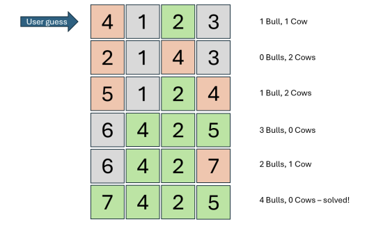

# Descripción del Juego

En esta sección, revisaremos las reglas de "Toros y Vacas".

**Reglas Básicas:**

* El objetivo del jugador es adivinar el código secreto, que es un número de cuatro dígitos sin dígitos repetidos, en el menor tiempo posible.
* Cada vez que el jugador hace un intento, este se compara con el código secreto.
* Por cada dígito adivinado correctamente **y** en la posición correcta, recibe un **Toro**. Al obtener cuatro Toros, gana.
* Por cada dígito adivinado correctamente pero en la posición incorrecta, recibe una **Vaca**.

---